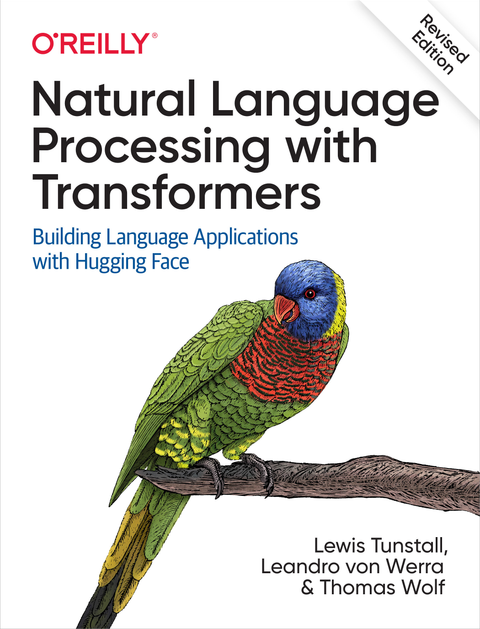
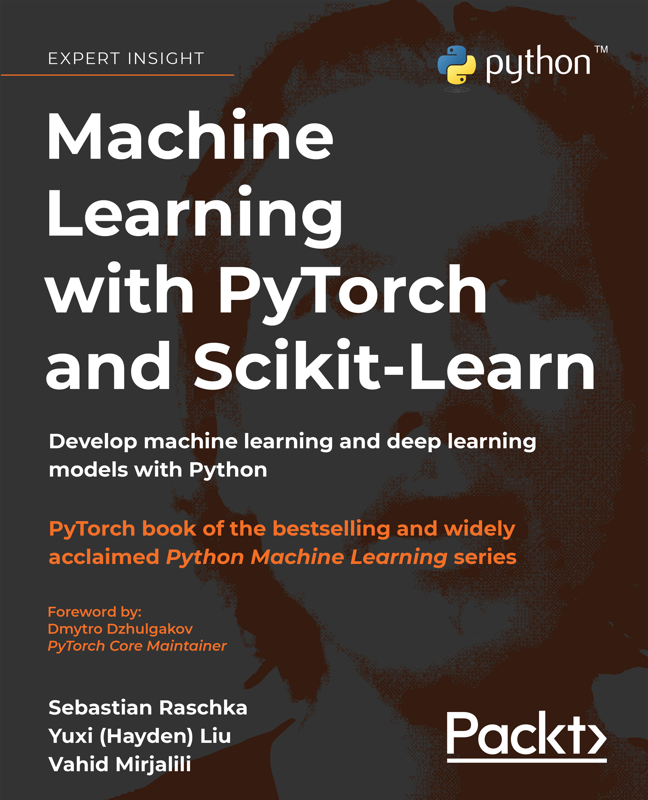

As an avid reader and lifelong learner, I find immense value in books that deepen my understanding of technology, leadership, and personal development. Below are some titles that have significantly influenced my journey, and I highly recommend them to anyone seeking to expand their knowledge and perspective.

## [Natural Language Processing with Transformers, Revised Edition](https://www.oreilly.com/library/view/natural-language-processing/9781098136789/)
**Authors**: Lewis Tunstall, Leandro von Werra, Thomas Wolf

{: style="max-width: 500px; height: auto;" alt="Book cover showing the title 'Natural Language Processing with Transformers' by Lewis Tunstall, Leandro von Werra, and Thomas Wolf"}

Transformers have redefined the landscape of natural language processing (NLP) since their introduction in 2017. They are now the dominant architecture for achieving state-of-the-art results in various NLP tasks. If you're a data scientist, coder, or AI enthusiast, this practical guide is an excellent resource for mastering transformer models using **Hugging Face Transformers**, one of the most popular Python-based deep learning libraries.

Authored by experts and contributors to Hugging Face Transformers, this book provides a hands-on approach to understanding, building, and applying transformers in real-world applications. Whether it's writing realistic news stories, enhancing search engine queries, or creating humorous chatbots, transformers have proven their versatility and power.

#### Why I Recommend This Book:

This book is a treasure trove of practical insights and techniques, making it a must-read for anyone exploring NLP. It doesn’t just focus on theory—it takes you step by step through coding examples and practical implementations. Here’s what you can expect:

- **Core NLP Tasks**: Learn how to build, debug, and optimize transformers for text classification, named entity recognition, and question answering.
- **Cross-Lingual Capabilities**: Discover how to leverage transformers for tasks across multiple languages.
- **Real-World Applications**: Get guidance on applying transformers in scenarios with limited labeled data.
- **Efficiency Techniques**: Explore methods like distillation, pruning, and quantization to make models efficient for deployment.
- **Scalability**: Learn to train transformers from scratch and scale them across multiple GPUs and distributed environments.

If you're looking to integrate cutting-edge NLP technology into your projects or simply want to deepen your understanding of transformers, this book is a perfect starting point.

Buy the book on [O'Reilly](https://www.oreilly.com/library/view/natural-language-processing/9781098136789/).

## [Machine Learning with PyTorch and Scikit-Learn](https://www.packtpub.com/en-us/product/machine-learning-with-pytorch-and-scikit-learn-9781801819312)
**Authors**: Sebastian Raschka, Yuxi (Hayden) Liu, Vahid Mirjalili

{: style="max-width: 500px; height: auto;" alt="Book cover showing the title 'Machine Learning with PyTorch and Scikit-Learn' by Sebastian Raschka, Yuxi (Hayden) Liu, and Vahid Mirjalili"}

This book is a cornerstone resource for anyone aiming to dive deep into the realms of machine learning (ML) and deep learning (DL) using PyTorch. Known for its practical approach, it combines theoretical foundations with hands-on examples, helping readers transition from understanding concepts to applying them in real-world scenarios.

The book explores both classic machine learning algorithms and modern deep learning techniques, making it a versatile guide for beginners and experienced practitioners alike. Its clear explanations, comprehensive coverage, and use of visualizations help demystify complex topics, enabling readers to confidently build their own ML and DL models.

#### Why I Recommend This Book:

This book is an invaluable resource for several reasons:
- Comprehensive Framework: It seamlessly integrates Scikit-Learn for traditional machine learning tasks and PyTorch for deep learning, providing a holistic learning experience.
- Hands-On Examples: The authors provide detailed tutorials and coding examples that cover everything from preprocessing data to deploying models.
- Cutting-Edge Topics: The book includes coverage of transformers, graph neural networks, GANs, and reinforcement learning, ensuring you stay updated with the latest trends.
- Best Practices: Gain insights into evaluating and tuning models, ensemble learning, and dimensionality reduction to make your solutions robust and effective.
- Scalable Learning: Learn how to build models that can handle large-scale data and leverage modern libraries like PyTorch Lightning for efficient experimentation.

#### What You’ll Learn:

1. Build and train machine learning classifiers for various data types, including images and text.
2. Implement advanced algorithms like transformers and GANs for modern ML tasks.
3. Explore clustering, regression, and sentiment analysis techniques.
4. Master best practices for hyperparameter tuning and model evaluation.
5. Understand and implement graph neural networks and reinforcement learning frameworks.

Whether you’re a Python developer new to machine learning or an experienced practitioner looking to refine your skills, this book offers a wealth of knowledge to help you create impactful applications.

Buy the book on [Packt](https://www.packtpub.com/en-us/product/machine-learning-with-pytorch-and-scikit-learn-9781801819312).